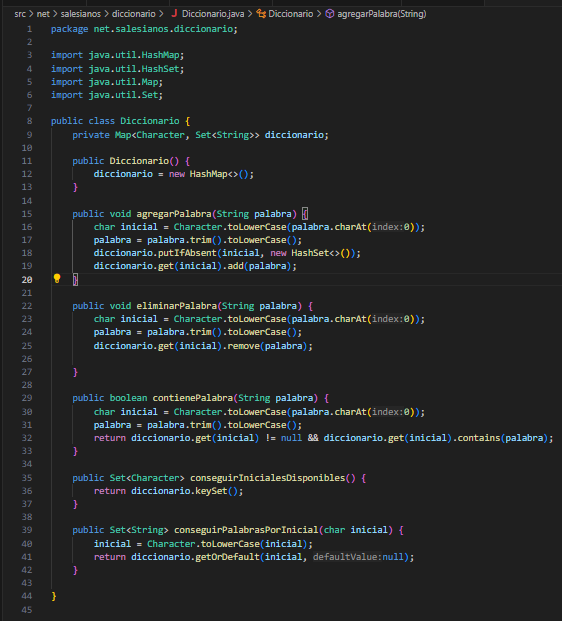
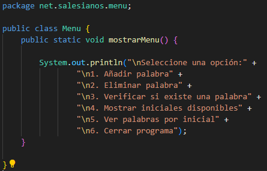
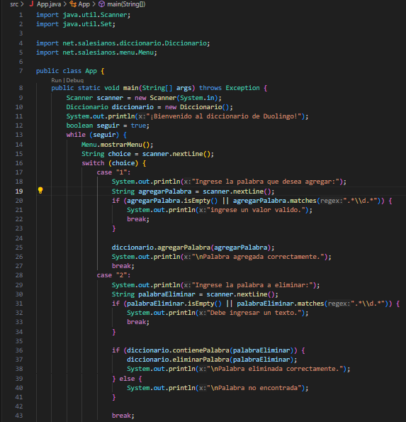
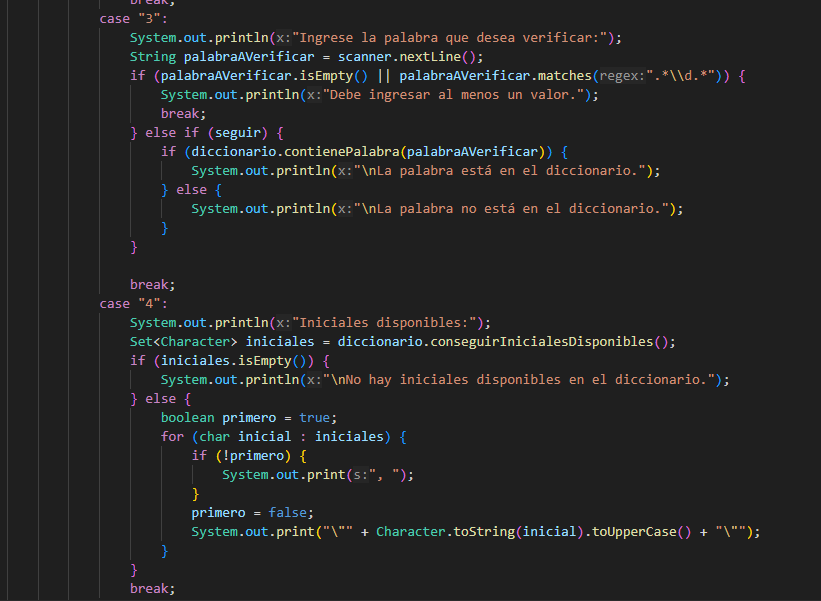
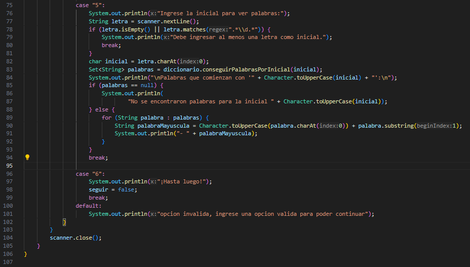

<h1>Documentacion de clases :</h1>

<h2>Clase Diccionario:</h2>

Esta clase tiene como atributo un Map, su key sera un caracter y su valor sera un arreglo set llamado diciconario, tendra 5 metodos los cuales nos permiten : 

-Agregar palabras :  
-Eliminar palabras    
-Verificar si existe una palabra    
-Conseguir las iniciales disponibles     
-Ver las palabras almecenadas por incial

<h2>Clase Menu:</h2>

<h4>la clase menu tiene un metodo estatico que nos printeara el menu cuando lo llamemos
</h4>

<h1>Clase App</h1>

-

la clase App es donde se ejecutara nuestro codigo, en ella tendremos un bucle while junto con un switch, en el caso uno usaremos la logica para agregar palabras y verifica que no sea un caracter numerico mediante una expresion regular, el caso 2 nos permitira eliminar palabras y verificara al igual que el caso uno.

el caso 3 nos permitira verificar que una palabra existe en nuestro diccionario y tambien verificara que la entrada no sea un numero, el caso 4 nos mostrara las iniciales disponibles.

el caso 5 nos permitira ingresar una inicial para ver que valores tiene esta, tambien verifica que la entrada no sea un valor numerico, el caso 6 cerrara el programa y por ultimo en caso que ingresemos un valor distinto nos mostrara un mensaje por pantalla para ingresar un valor valido

[volver](../README.md)